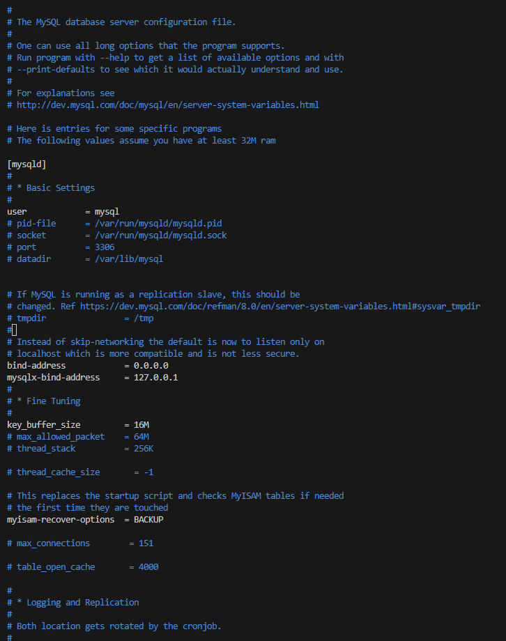

# CLIENT-SERVER ARCHITECTURE WITH MYSQL DATABASE MANAGEMENT SYSTEM (DBMS)

## TASK – Implement a Client Server Architecture using MySQL Database Management System (DBMS)

### To demonstrate a basic client-server using MySQL Relational Database Management System (RDBMS), follow the below instructions

1. Create and configure two Linux-based virtual servers (EC2 instances in AWS).

    Server A name - `mysql server`

    Server B name - `mysql client`

2. On mysql server Linux Server install MySQL Server software.

$ `sudo apt update`

$ `sudo apt install mysql-server`

$ `sudo systemctl enable mysql`

$ `sudo systemctl start mysql`

3. On mysql client Linux Server install MySQL Client software.

$ `sudo apt update`

$ `sudo apt install mysql-client`

$ `sudo systemctl enable mysql`

$ `sudo systemctl start mysql`

4. Configure MySQL server to allow connections from remote hosts

$ `sudo vi /etc/mysql/mysql.conf.d/mysqld.cn`

Replace ‘127.0.0.1’ to ‘0.0.0.0’ like this

Rememberto open TCP port 3306 since this is the default port for mysql connection

5. By default, both of your EC2 virtual servers are located in the same local virtual network, so they can communicate to each other using local IP addresses. Use mysql server's local IP address to connect from mysql client.

    From mysql client Linux Server connect remotely to mysql server Database Engine without using SSH. You must use the mysql utility to perform this action

    

7. Check that you have successfully connected to a remote MySQL server and can perform SQL queries

       show databases;

If you see an output similar to the image above, then you have successfully completed this project – you have deloyed a fully functional MySQL Client-Server set up.